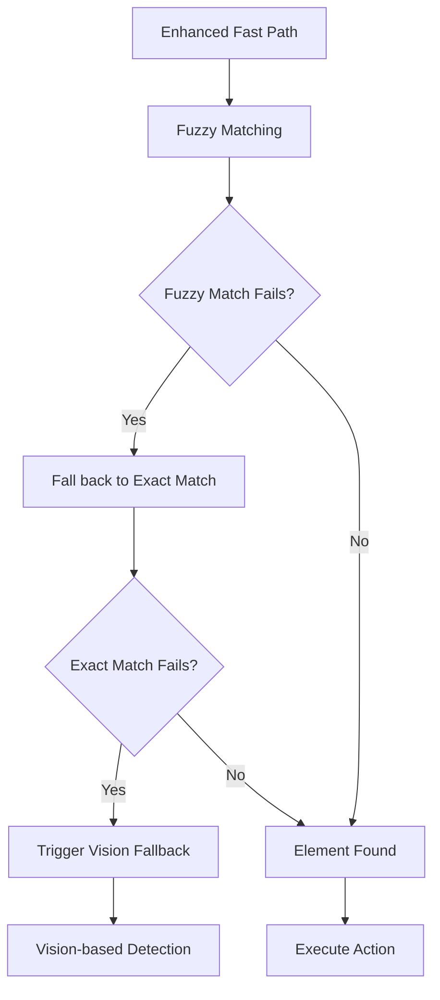

# AURA Accessibility Fast Path Enhancement Design Document

## Overview

The AURA Accessibility Fast Path Enhancement addresses critical performance bottlenecks in the current accessibility module where valid GUI commands fail to execute via the fast path and unnecessarily fall back to the slower vision-based workflow. The enhancement implements three core improvements: broader element role detection, multi-attribute text searching, and fuzzy string matching with intelligent target extraction.

The current system fails on commands like "Click on the Gmail link" because it only searches for AXButton elements and performs exact string matching on AXTitle attributes. This design expands the search capabilities to handle all clickable element types and implements intelligent text matching that can handle variations between user commands and accessibility labels.

## Architecture

### Enhanced Element Detection Flow

```mermaid
graph TB
    Command[User Command: "Click on Gmail link"] --> Extract[Target Extraction]
    Extract --> Target["gmail link"]
    Target --> Search[Enhanced Element Search]

    Search --> Roles[Check All Clickable Roles]
    Roles --> AXButton[AXButton]
    Roles --> AXLink[AXLink]
    Roles --> AXMenuItem[AXMenuItem]
    Roles --> AXCheckBox[AXCheckBox]
    Roles --> AXRadioButton[AXRadioButton]

    AXLink --> Attributes[Multi-Attribute Search]
    Attributes --> AXTitle[Check AXTitle: "Google Mail"]
    Attributes --> AXDescription[Check AXDescription]
    Attributes --> AXValue[Check AXValue]

    AXTitle --> Fuzzy[Fuzzy Match: "gmail link" vs "Google Mail"]
    Fuzzy --> Score[Score: 87% > 85% threshold]
    Score --> Match[Element Found!]
    Match --> Execute[Execute Click Action]
```

### System Integration Points

The enhancement integrates with existing AURA components at three key points:

1. **Orchestrator Integration**: Enhanced target extraction in `_extract_gui_elements_from_command()`
2. **AccessibilityModule Enhancement**: Improved element detection in `find_element()` method
3. **Configuration Integration**: New fuzzy matching settings in `config.py`

## Components and Interfaces

### Enhanced AccessibilityModule

**New Constants and Configuration**:

```python
# Clickable element roles for comprehensive detection
CLICKABLE_ROLES = {
    "AXButton", "AXLink", "AXMenuItem",
    "AXCheckBox", "AXRadioButton"
}

# Accessibility attributes to check in priority order
ACCESSIBILITY_ATTRIBUTES = ["AXTitle", "AXDescription", "AXValue"]

# Fuzzy matching configuration
FUZZY_CONFIDENCE_THRESHOLD = 85  # Configurable via config.py
```

**Enhanced Element Search Method**:

```python
def find_element_enhanced(self, role: str, label: str, app_name: Optional[str] = None) -> Optional[Dict[str, Any]]:
    """
    Enhanced element finding with multi-role, multi-attribute, and fuzzy matching.

    Args:
        role: Target element role (can be empty for broader search)
        label: Target element label/text
        app_name: Optional application name for scoped search

    Returns:
        Element information dict or None if not found
    """
```

**Multi-Attribute Text Matching**:

```python
def _check_element_text_match(self, element, target_text: str) -> Tuple[bool, float, str]:
    """
    Check if element text matches target using multi-attribute fuzzy matching.

    Args:
        element: Accessibility element to check
        target_text: Text to match against

    Returns:
        Tuple of (match_found, confidence_score, matched_attribute)
    """
```

### Enhanced Orchestrator Integration

**Improved Target Extraction**:

```python
def _extract_target_from_command(self, command: str) -> str:
    """
    Extract target element name from natural language command.

    Removes action words ("click", "type", "press") and articles ("the", "on", "a", "an")
    to isolate the target element name.

    Args:
        command: Natural language command

    Returns:
        Extracted target element name

    Examples:
        "Click on the Gmail link" -> "gmail link"
        "Press the Submit button" -> "submit button"
        "Type in the search box" -> "search box"
    """
```

**Enhanced GUI Element Extraction**:

```python
def _extract_gui_elements_from_command(self, command: str) -> Dict[str, Any]:
    """
    Enhanced GUI element extraction with intelligent target parsing.

    Returns:
        {
            'role': '',  # Empty for broader search
            'label': 'extracted_target',  # Cleaned target text
            'app_name': None,
            'action_type': 'click|type|press',
            'confidence': 0.95
        }
    """
```

### Configuration Enhancements

**New Configuration Parameters**:

```python
# Fuzzy matching configuration
FUZZY_MATCHING_ENABLED = True
FUZZY_CONFIDENCE_THRESHOLD = 85
FUZZY_MATCHING_TIMEOUT = 200  # milliseconds

# Element detection configuration
CLICKABLE_ROLES = ["AXButton", "AXLink", "AXMenuItem", "AXCheckBox", "AXRadioButton"]
ACCESSIBILITY_ATTRIBUTES = ["AXTitle", "AXDescription", "AXValue"]

# Performance configuration
FAST_PATH_TIMEOUT = 2000  # milliseconds
ATTRIBUTE_CHECK_TIMEOUT = 500  # milliseconds

# Debugging configuration
ACCESSIBILITY_DEBUG_LOGGING = False
LOG_FUZZY_MATCH_SCORES = False
```

## Data Models

### Enhanced Element Match Result

```python
@dataclass
class ElementMatchResult:
    """Enhanced result from element matching with detailed metadata."""
    element: Optional[Dict[str, Any]]
    found: bool
    confidence_score: float
    matched_attribute: str
    search_time_ms: float
    roles_checked: List[str]
    attributes_checked: List[str]
    fuzzy_matches: List[Dict[str, Any]]  # All fuzzy matches with scores
    fallback_triggered: bool = False

    def to_dict(self) -> Dict[str, Any]:
        """Convert to dictionary for logging and debugging."""
        return {
            'found': self.found,
            'confidence_score': self.confidence_score,
            'matched_attribute': self.matched_attribute,
            'search_time_ms': self.search_time_ms,
            'roles_checked': self.roles_checked,
            'attributes_checked': self.attributes_checked,
            'fuzzy_match_count': len(self.fuzzy_matches),
            'fallback_triggered': self.fallback_triggered
        }
```

### Target Extraction Result

```python
@dataclass
class TargetExtractionResult:
    """Result from command target extraction."""
    original_command: str
    extracted_target: str
    action_type: str
    confidence: float
    removed_words: List[str]
    processing_time_ms: float

    def to_dict(self) -> Dict[str, Any]:
        """Convert to dictionary for logging."""
        return {
            'original_command': self.original_command,
            'extracted_target': self.extracted_target,
            'action_type': self.action_type,
            'confidence': self.confidence,
            'removed_words': self.removed_words,
            'processing_time_ms': self.processing_time_ms
        }
```

## Error Handling

### Enhanced Error Categories

**New Exception Types**:

```python
class FuzzyMatchingError(Exception):
    """Raised when fuzzy matching operations fail."""
    def __init__(self, message: str, target_text: str, element_text: str):
        super().__init__(message)
        self.target_text = target_text
        self.element_text = element_text

class TargetExtractionError(Exception):
    """Raised when target extraction from command fails."""
    def __init__(self, message: str, command: str):
        super().__init__(message)
        self.command = command

class AttributeAccessError(Exception):
    """Raised when accessibility attribute access fails."""
    def __init__(self, message: str, attribute: str, element_info: Dict[str, Any]):
        super().__init__(message)
        self.attribute = attribute
        self.element_info = element_info
```

### Graceful Degradation Strategy

1. **Fuzzy Matching Failure**: Fall back to exact string matching
2. **Library Unavailable**: Gracefully disable fuzzy matching with warning
3. **Attribute Access Failure**: Skip failed attributes, continue with remaining
4. **Performance Timeout**: Return partial results, trigger vision fallback
5. **Configuration Error**: Use default values, log warnings

### Error Recovery Flow



## Testing Strategy

### Unit Testing

**Fuzzy Matching Tests**:

- Test various text similarity scenarios
- Verify confidence threshold behavior
- Test performance with different string lengths
- Validate fallback to exact matching

**Target Extraction Tests**:

- Test command parsing with various phrasings
- Verify action word and article removal
- Test edge cases with minimal commands
- Validate confidence scoring

**Multi-Attribute Search Tests**:

- Test attribute priority ordering
- Verify graceful handling of missing attributes
- Test performance with multiple attributes
- Validate attribute access error handling

### Integration Testing

**End-to-End Command Flow**:

- Test complete command execution with enhanced fast path
- Verify fallback behavior when fast path fails
- Test performance improvements vs. current system
- Validate backward compatibility

**Real Application Testing**:

- Test with common applications (Safari, Chrome, Mail)
- Verify element detection across different UI frameworks
- Test with various accessibility label formats
- Validate performance under different system loads

### Performance Testing

**Response Time Benchmarks**:

- Measure enhanced fast path execution time
- Compare against current implementation
- Verify sub-2-second performance target
- Test with various element tree sizes

**Fuzzy Matching Performance**:

- Benchmark fuzzy matching algorithm performance
- Test with various string lengths and complexities
- Verify 200ms timeout compliance
- Measure memory usage impact

## Security Considerations

### Input Validation

- Sanitize user commands before target extraction
- Validate fuzzy matching confidence thresholds
- Limit maximum string lengths for performance
- Prevent injection attacks through command parsing

### Privacy Protection

- Avoid logging sensitive accessibility element content
- Implement configurable logging levels for debugging
- Ensure fuzzy matching doesn't expose element text
- Maintain existing accessibility permission requirements

## Performance Optimization

### Caching Strategy

- Cache fuzzy matching results for repeated commands
- Implement element attribute caching
- Use existing accessibility element cache
- Cache target extraction results for similar commands

### Parallel Processing

- Perform fuzzy matching in parallel for multiple attributes
- Use existing background thread pools
- Implement timeout-based cancellation
- Maintain thread safety for shared resources

### Memory Management

- Limit fuzzy matching result storage
- Implement LRU cache for target extractions
- Monitor memory usage of enhanced features
- Provide configuration for memory limits

## Implementation Phases

### Phase 1: Core Fuzzy Matching (Requirements 3, 5)

- Add thefuzz library dependency
- Implement basic fuzzy string matching
- Add configuration parameters
- Implement graceful degradation

### Phase 2: Multi-Role Detection (Requirements 1, 5)

- Expand CLICKABLE_ROLES constant
- Modify element search loops
- Update role checking logic
- Maintain backward compatibility

### Phase 3: Multi-Attribute Search (Requirements 2, 5)

- Implement attribute priority checking
- Add error handling for attribute access
- Update element matching logic
- Add comprehensive logging

### Phase 4: Target Extraction Enhancement (Requirements 4, 6)

- Implement command parsing logic
- Add action word and article removal
- Integrate with orchestrator
- Add configuration options

### Phase 5: Performance Optimization (Requirements 7, 8)

- Add performance monitoring
- Implement caching strategies
- Add timeout handling
- Comprehensive logging and metrics

Each phase maintains backward compatibility and includes comprehensive testing to ensure system stability throughout the enhancement process.
