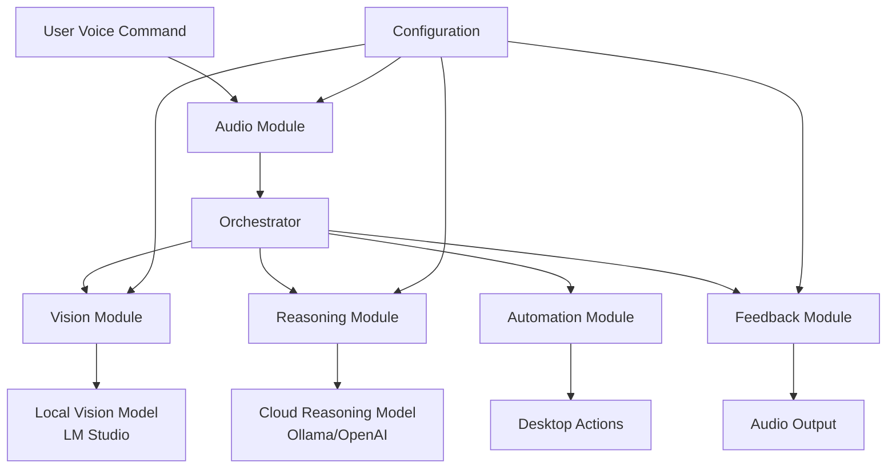

# AURA Design Document

## Overview

AURA (Autonomous User-side Robotic Assistant) is a hybrid AI system that combines local computer vision with cloud-based reasoning to enable natural language control of desktop computers. The system follows a perception-reasoning-action loop, where it captures and analyzes screen content, processes user commands through advanced language models, and executes precise automation actions.

The architecture is designed to be modular, scalable, and fault-tolerant, with clear separation between perception (vision), cognition (reasoning), and action (automation) components.

## Architecture

### High-Level Architecture



### System Flow

1. **Wake Word Detection**: Continuous monitoring for activation phrase
2. **Voice Capture**: Speech-to-text conversion of user commands
3. **Screen Perception**: Screenshot capture and vision model analysis
4. **Command Reasoning**: LLM-based action plan generation
5. **Action Execution**: Automated GUI interactions
6. **Feedback Loop**: Audio confirmation and status updates

### Technology Stack

- **Local Vision**: LM Studio with multimodal models (Gemma-3-4b)
- **Cloud Reasoning**: Ollama Cloud or OpenAI API
- **Wake Word**: Picovoice Porcupine
- **Speech Recognition**: OpenAI Whisper
- **Text-to-Speech**: Piper TTS or system TTS
- **Screen Capture**: MSS (Multi-Screen Screenshot)
- **GUI Automation**: PyAutoGUI
- **Audio Playback**: Pygame

## Components and Interfaces

### Configuration Module (`config.py`)

**Purpose**: Centralized configuration management for all system parameters.

**Key Components**:

- API endpoints and authentication keys
- Model names and parameters
- Audio settings and file paths
- Prompt templates for vision and reasoning

**Interface**:

```python
# Configuration constants accessible to all modules
VISION_API_BASE: str
REASONING_API_BASE: str
VISION_MODEL: str
REASONING_MODEL: str
PORCUPINE_API_KEY: str
WAKE_WORD: str
VISION_PROMPT: str
REASONING_META_PROMPT: str
SOUNDS: dict
```

### Vision Module (`modules/vision.py`)

**Purpose**: Handles screen capture and communication with local vision models.

**Key Methods**:

- `capture_screen_as_base64()`: Screenshot capture and encoding
- `describe_screen()`: Vision model API communication

**Interface**:

```python
class VisionModule:
    def capture_screen_as_base64() -> str
    def describe_screen() -> dict
```

**Data Flow**:

1. Capture full desktop screenshot using MSS
2. Encode image as base64 for API transmission
3. Send to local LM Studio vision model with structured prompt
4. Return JSON description of interactive elements with coordinates

### Reasoning Module (`modules/reasoning.py`)

**Purpose**: Communicates with cloud-based LLMs for intelligent action planning.

**Key Methods**:

- `get_action_plan()`: Generate structured action sequences

**Interface**:

```python
class ReasoningModule:
    def get_action_plan(user_command: str, screen_context: dict) -> dict
```

**Action Types**:

- `click`: Single click at coordinates
- `double_click`: Double click at coordinates
- `type`: Text input
- `scroll`: Directional scrolling
- `speak`: TTS output to user
- `finish`: Task completion marker

### Audio Module (`modules/audio.py`)

**Purpose**: Handles all audio input/output including wake word detection, STT, and TTS.

**Key Methods**:

- `listen_for_wake_word()`: Continuous wake word monitoring
- `speech_to_text()`: Convert voice to text
- `text_to_speech()`: Convert text to voice

**Interface**:

```python
class AudioModule:
    def listen_for_wake_word() -> bool
    def speech_to_text() -> str
    def text_to_speech(text: str) -> None
```

### Automation Module (`modules/automation.py`)

**Purpose**: Executes GUI actions using PyAutoGUI with safety controls.

**Key Methods**:

- `execute_action()`: Parse and execute individual actions

**Interface**:

```python
class AutomationModule:
    def execute_action(action: dict) -> None
```

**Safety Features**:

- Smooth cursor movement with configurable duration
- Input validation for coordinates and text
- Error handling for failed actions

### Feedback Module (`modules/feedback.py`)

**Purpose**: Provides audio feedback using sound effects and TTS.

**Key Methods**:

- `play()`: Play predefined sound effects
- `speak()`: Text-to-speech output

**Interface**:

```python
class FeedbackModule:
    def play(sound_name: str) -> None
    def speak(message: str) -> None
```

### Orchestrator (`orchestrator.py`)

**Purpose**: Central coordinator that manages the perception-reasoning-action loop.

**Key Methods**:

- `execute_command()`: Main command processing pipeline
- `answer_question()`: Information extraction mode

**Interface**:

```python
class Orchestrator:
    def execute_command(command: str) -> None
    def answer_question(question: str) -> None
```

**Processing Pipeline**:

1. Validate and preprocess user command
2. Capture and analyze current screen state
3. Generate action plan using reasoning model
4. Execute actions with feedback
5. Handle errors and provide status updates

## Data Models

### Screen Context Model

```python
{
    "elements": [
        {
            "type": "button|link|input|text",
            "text": "element text content",
            "coordinates": [x1, y1, x2, y2],
            "description": "element description"
        }
    ],
    "text_blocks": [
        {
            "content": "significant text content",
            "coordinates": [x1, y1, x2, y2]
        }
    ],
    "metadata": {
        "timestamp": "ISO timestamp",
        "screen_resolution": [width, height]
    }
}
```

### Action Plan Model

```python
{
    "plan": [
        {
            "action": "click|double_click|type|scroll|speak|finish",
            "coordinates": [x, y],  # for click actions
            "text": "text to type",  # for type actions
            "direction": "up|down|left|right",  # for scroll actions
            "amount": 100,  # for scroll actions
            "message": "text to speak"  # for speak actions
        }
    ],
    "metadata": {
        "confidence": 0.95,
        "estimated_duration": 5.2
    }
}
```

## Error Handling

### Error Categories

1. **API Errors**: Network failures, authentication issues, model unavailability
2. **Processing Errors**: Invalid responses, parsing failures, timeout errors
3. **Execution Errors**: GUI automation failures, coordinate validation errors
4. **Audio Errors**: Microphone access, speaker output, wake word detection

### Error Recovery Strategies

- **Graceful Degradation**: Continue operation with reduced functionality
- **Retry Logic**: Automatic retry with exponential backoff
- **User Notification**: Clear audio feedback about errors and recovery
- **Fallback Modes**: Alternative processing paths when primary systems fail

### Logging and Monitoring

- Structured logging with severity levels
- Performance metrics tracking
- Error rate monitoring
- User interaction analytics

## Testing Strategy

### Unit Testing

- **Vision Module**: Mock API responses, test image processing
- **Reasoning Module**: Test prompt generation and response parsing
- **Audio Module**: Test STT/TTS functionality with sample audio
- **Automation Module**: Test action parsing and validation
- **Configuration**: Test parameter loading and validation

### Integration Testing

- **End-to-End Workflows**: Complete command execution cycles
- **API Integration**: Real API calls with test accounts
- **Cross-Module Communication**: Interface compatibility testing
- **Error Scenarios**: Failure mode testing and recovery

### Performance Testing

- **Response Time**: Measure perception-to-action latency
- **Resource Usage**: Monitor CPU, memory, and network usage
- **Concurrent Operations**: Test multiple simultaneous requests
- **Stress Testing**: High-frequency command processing

### User Acceptance Testing

- **Voice Recognition Accuracy**: Test with various accents and environments
- **Command Understanding**: Test natural language interpretation
- **Action Precision**: Verify GUI automation accuracy
- **User Experience**: Test overall workflow satisfaction

## Security Considerations

### API Security

- Secure storage of API keys using environment variables
- HTTPS-only communication with cloud services
- API rate limiting and quota management
- Authentication token rotation

### Local Security

- Screen capture permission management
- Microphone access controls
- File system access restrictions
- Process isolation and sandboxing

### Privacy Protection

- Local processing preference for sensitive data
- Minimal data transmission to cloud services
- User consent for data collection
- Audit logging for security events

## Performance Optimization

### Latency Reduction

- Local model caching and optimization
- Parallel processing where possible
- Efficient image compression for API calls
- Connection pooling for API requests

### Resource Management

- Memory-efficient image processing
- CPU usage optimization for continuous monitoring
- Battery usage considerations for mobile devices
- Network bandwidth optimization

### Scalability Considerations

- Modular architecture for easy component scaling
- Configuration-driven model selection
- Support for multiple concurrent users
- Cloud service failover capabilities
