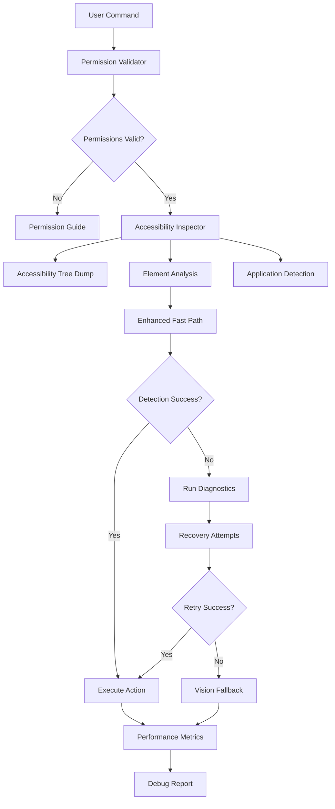
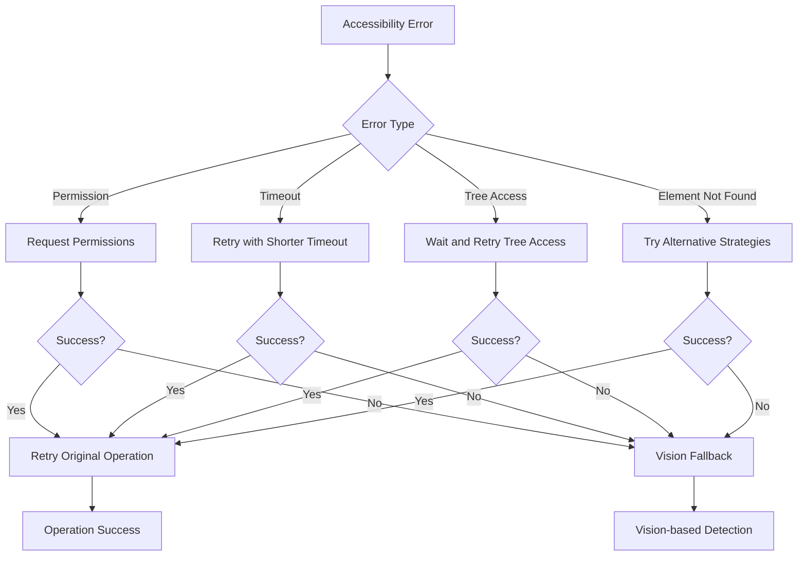

# AURA Click Debugging Enhancement Design Document

## Overview

The AURA Click Debugging Enhancement addresses the persistent fast path failures observed in the system logs where commands like "Click on Google search" consistently fail element detection and fall back to the vision workflow. The logs show "Enhanced role detection failed, falling back to button-only detection" and "element_not_found" errors, indicating fundamental issues with accessibility permissions, element detection logic, or application-specific accessibility implementations.

This design implements a comprehensive debugging and diagnostic framework that will:

1. Provide real-time accessibility tree inspection
2. Validate and guide accessibility permission setup
3. Implement adaptive detection strategies for different applications
4. Add comprehensive logging and error recovery mechanisms
5. Create automated diagnostic tools for troubleshooting

## Architecture

### Debugging Framework Overview



### System Integration Points

The debugging enhancement integrates with existing AURA components at four key points:

1. **Startup Integration**: Accessibility permission validation during system initialization
2. **Orchestrator Integration**: Enhanced debugging in fast path execution
3. **AccessibilityModule Enhancement**: Real-time tree inspection and diagnostics
4. **Configuration Integration**: Debugging levels and diagnostic tool settings

## Components and Interfaces

### AccessibilityDebugger

**Core Debugging Infrastructure**:

```python
class AccessibilityDebugger:
    """
    Comprehensive debugging and diagnostic tools for accessibility issues.
    """

    def __init__(self, config: Dict[str, Any]):
        self.debug_level = config.get('debug_level', 'BASIC')
        self.output_format = config.get('output_format', 'STRUCTURED')
        self.auto_diagnostics = config.get('auto_diagnostics', True)
        self.performance_tracking = config.get('performance_tracking', True)

    def validate_accessibility_permissions(self) -> PermissionStatus:
        """
        Comprehensive accessibility permission validation.

        Returns:
            PermissionStatus with detailed permission information
        """

    def dump_accessibility_tree(self, app_name: Optional[str] = None) -> AccessibilityTreeDump:
        """
        Generate complete accessibility tree dump for analysis.

        Args:
            app_name: Optional application name to focus on

        Returns:
            Structured accessibility tree with all elements and attributes
        """

    def analyze_element_detection_failure(self, command: str, target: str) -> FailureAnalysis:
        """
        Analyze why element detection failed for a specific command.

        Args:
            command: Original user command
            target: Extracted target text

        Returns:
            Detailed analysis of failure reasons and potential solutions
        """

    def run_comprehensive_diagnostics(self) -> DiagnosticReport:
        """
        Run complete accessibility health check and diagnostics.

        Returns:
            Comprehensive diagnostic report with recommendations
        """
```

### Enhanced Permission Validator

**Permission Detection and Guidance**:

```python
class PermissionValidator:
    """
    Validates and guides accessibility permission setup.
    """

    def check_accessibility_permissions(self) -> PermissionStatus:
        """
        Check current accessibility permission status.

        Returns:
            Detailed permission status with specific capabilities
        """

    def guide_permission_setup(self) -> List[str]:
        """
        Provide step-by-step permission setup instructions.

        Returns:
            List of instructions for granting accessibility permissions
        """

    def attempt_permission_request(self) -> bool:
        """
        Attempt to programmatically request accessibility permissions.

        Returns:
            True if permissions were granted, False otherwise
        """

    def monitor_permission_changes(self) -> None:
        """
        Monitor for runtime permission changes and update capabilities.
        """
```

### Application-Specific Detection Strategies

**Adaptive Element Detection**:

```python
class ApplicationDetectionStrategy:
    """
    Application-specific accessibility detection strategies.
    """

    def detect_application_type(self, app_name: str) -> ApplicationType:
        """
        Detect application type and optimal detection strategy.

        Args:
            app_name: Name of the target application

        Returns:
            Application type with recommended detection parameters
        """

    def get_detection_strategy(self, app_type: ApplicationType) -> DetectionStrategy:
        """
        Get optimal detection strategy for application type.

        Args:
            app_type: Detected application type

        Returns:
            Detection strategy with specific parameters and methods
        """

    def adapt_search_parameters(self, app_type: ApplicationType, command: str) -> SearchParameters:
        """
        Adapt search parameters for specific application type.

        Args:
            app_type: Application type
            command: User command

        Returns:
            Optimized search parameters for the application
        """
```

### Enhanced Error Recovery

**Intelligent Recovery Mechanisms**:

```python
class ErrorRecoveryManager:
    """
    Manages error recovery and retry strategies for accessibility failures.
    """

    def attempt_recovery(self, error: AccessibilityError, context: Dict[str, Any]) -> RecoveryResult:
        """
        Attempt to recover from accessibility errors.

        Args:
            error: The accessibility error that occurred
            context: Context information about the failure

        Returns:
            Recovery result with success status and actions taken
        """

    def retry_with_backoff(self, operation: Callable, max_retries: int = 3) -> Any:
        """
        Retry operation with exponential backoff.

        Args:
            operation: Operation to retry
            max_retries: Maximum number of retry attempts

        Returns:
            Operation result or raises exception after max retries
        """

    def try_alternative_strategies(self, target: str, app_name: str) -> Optional[Dict[str, Any]]:
        """
        Try alternative detection strategies when primary method fails.

        Args:
            target: Target element text
            app_name: Application name

        Returns:
            Element information if found, None otherwise
        """
```

## Data Models

### Permission Status

```python
@dataclass
class PermissionStatus:
    """Detailed accessibility permission status."""
    has_permissions: bool
    permission_level: str  # 'NONE', 'PARTIAL', 'FULL'
    missing_permissions: List[str]
    granted_permissions: List[str]
    can_request_permissions: bool
    system_version: str
    recommendations: List[str]

    def to_dict(self) -> Dict[str, Any]:
        """Convert to dictionary for logging."""
        return asdict(self)
```

### Accessibility Tree Dump

```python
@dataclass
class AccessibilityTreeDump:
    """Complete accessibility tree structure."""
    app_name: str
    timestamp: datetime
    root_element: Dict[str, Any]
    total_elements: int
    clickable_elements: List[Dict[str, Any]]
    searchable_elements: List[Dict[str, Any]]
    element_roles: Dict[str, int]  # Role counts
    attribute_coverage: Dict[str, int]  # Attribute availability

    def find_elements_by_text(self, text: str, fuzzy: bool = True) -> List[Dict[str, Any]]:
        """Find elements matching text with optional fuzzy matching."""

    def get_elements_by_role(self, role: str) -> List[Dict[str, Any]]:
        """Get all elements with specific role."""

    def to_json(self) -> str:
        """Export tree dump as JSON for analysis."""
```

### Failure Analysis

```python
@dataclass
class FailureAnalysis:
    """Detailed analysis of element detection failure."""
    command: str
    target_text: str
    app_name: str
    failure_reasons: List[str]
    attempted_strategies: List[str]
    available_elements: List[Dict[str, Any]]
    closest_matches: List[Dict[str, Any]]
    similarity_scores: Dict[str, float]
    recommendations: List[str]
    recovery_suggestions: List[str]

    def to_dict(self) -> Dict[str, Any]:
        """Convert to dictionary for logging."""
        return asdict(self)
```

### Diagnostic Report

```python
@dataclass
class DiagnosticReport:
    """Comprehensive system diagnostic report."""
    timestamp: datetime
    permission_status: PermissionStatus
    accessibility_health: Dict[str, Any]
    performance_metrics: Dict[str, Any]
    detected_issues: List[Dict[str, Any]]
    recommendations: List[str]
    success_rate: float
    average_response_time: float

    def generate_summary(self) -> str:
        """Generate human-readable diagnostic summary."""

    def export_report(self, format: str = 'JSON') -> str:
        """Export report in specified format."""
```

## Error Handling

### Enhanced Error Categories

**New Exception Types**:

```python
class AccessibilityPermissionError(Exception):
    """Raised when accessibility permissions are insufficient."""
    def __init__(self, message: str, permission_status: PermissionStatus):
        super().__init__(message)
        self.permission_status = permission_status

class AccessibilityTreeError(Exception):
    """Raised when accessibility tree access fails."""
    def __init__(self, message: str, app_name: str, error_code: str):
        super().__init__(message)
        self.app_name = app_name
        self.error_code = error_code

class ElementDetectionTimeoutError(Exception):
    """Raised when element detection times out."""
    def __init__(self, message: str, timeout_duration: float, search_params: Dict[str, Any]):
        super().__init__(message)
        self.timeout_duration = timeout_duration
        self.search_params = search_params

class ApplicationDetectionError(Exception):
    """Raised when application type detection fails."""
    def __init__(self, message: str, app_name: str):
        super().__init__(message)
        self.app_name = app_name
```

### Recovery Flow



## Testing Strategy

### Debugging Tool Tests

**Permission Validation Tests**:

- Test permission detection on systems with various permission states
- Verify permission request functionality
- Test permission monitoring and runtime updates
- Validate permission guidance accuracy

**Tree Inspection Tests**:

- Test accessibility tree dumping with various applications
- Verify element attribute extraction completeness
- Test tree navigation and search functionality
- Validate JSON export and import functionality

**Diagnostic Tests**:

- Test comprehensive diagnostic execution
- Verify issue detection accuracy
- Test recommendation generation
- Validate diagnostic report formatting

### Integration Testing

**End-to-End Debugging Flow**:

- Test complete debugging workflow from command failure to resolution
- Verify error recovery mechanisms
- Test application-specific detection strategies
- Validate performance monitoring and reporting

**Real Application Testing**:

- Test debugging tools with Safari, Chrome, Mail, and other common applications
- Verify application type detection accuracy
- Test adaptive detection strategies
- Validate cross-application consistency

### Performance Testing

**Debugging Overhead**:

- Measure performance impact of debugging features
- Test with various debug levels
- Verify timeout handling effectiveness
- Measure memory usage of tree dumps and diagnostics

## Security Considerations

### Privacy Protection

- Sanitize accessibility tree dumps to remove sensitive content
- Implement configurable content filtering for logs
- Ensure diagnostic reports don't expose private information
- Maintain secure handling of accessibility permissions

### System Security

- Validate all accessibility API interactions
- Implement safe permission request mechanisms
- Ensure debugging tools don't compromise system security
- Maintain existing security boundaries

## Implementation Phases

### Phase 1: Permission Validation and Guidance (Requirements 2)

- Implement comprehensive permission checking
- Add permission request functionality
- Create step-by-step permission guides
- Add runtime permission monitoring

### Phase 2: Accessibility Tree Inspection (Requirements 1, 3)

- Implement tree dumping functionality
- Add element attribute inspection
- Create interactive debugging tools
- Add tree search and analysis features

### Phase 3: Application Detection and Adaptation (Requirements 4)

- Implement application type detection
- Add application-specific detection strategies
- Create adaptive search parameters
- Add strategy caching and optimization

### Phase 4: Error Recovery and Diagnostics (Requirements 5, 8)

- Implement intelligent error recovery
- Add retry mechanisms with backoff
- Create comprehensive diagnostic tools
- Add automated health checking

### Phase 5: Performance Monitoring and Reporting (Requirements 6, 7)

- Add configurable debugging levels
- Implement performance tracking
- Create diagnostic reporting
- Add real-time feedback mechanisms

Each phase includes comprehensive testing and maintains backward compatibility with existing functionality.
