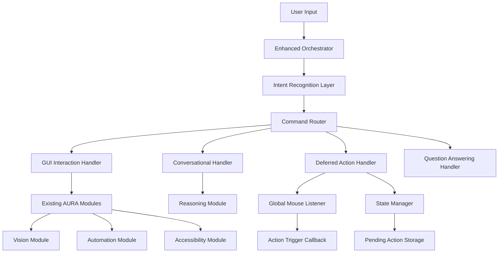
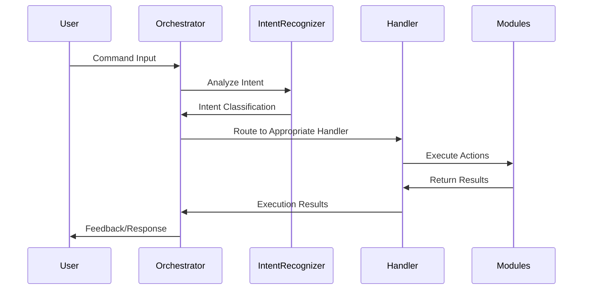
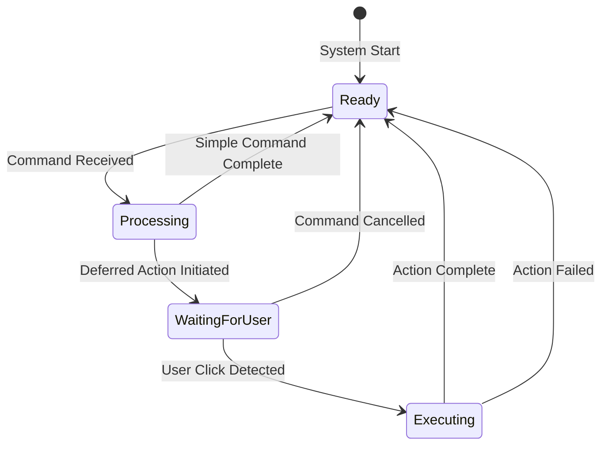
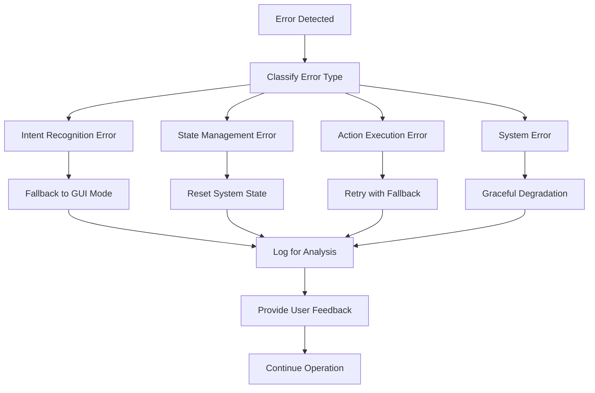

# Design Document

## Overview

The conversational AURA enhancement transforms the existing command-driven AI assistant into a sophisticated, stateful conversational agent capable of handling multiple interaction modes. The design builds upon AURA's existing modular architecture while introducing intelligent intent recognition, deferred action capabilities, and seamless mode switching between GUI automation, natural conversation, and multi-step workflows.

The enhancement maintains full backward compatibility with existing functionality while adding new conversational layers that operate through the existing orchestrator pattern. The system will intelligently route user inputs to appropriate handlers based on detected intent, enabling natural conversation alongside precise GUI automation.

## Architecture

### High-Level Architecture

The enhanced system follows a layered architecture with the orchestrator acting as an intelligent router:



### Intent Recognition Flow

The system uses a two-stage approach for command processing:

1. **Intent Classification**: LLM-based analysis determines the primary intent
2. **Handler Routing**: Commands are routed to specialized handlers based on intent



### State Management Architecture

The system maintains state for multi-step interactions while preserving stateless operation for simple commands:



## Components and Interfaces

### Enhanced Orchestrator

The orchestrator is enhanced with new capabilities while maintaining existing functionality:

**New State Variables:**

- `is_waiting_for_user_action: bool` - Tracks deferred action state
- `pending_action_payload: str` - Stores generated content for deferred actions
- `deferred_action_type: str` - Type of action to perform (type, click, etc.)
- `mouse_listener: GlobalMouseListener` - Global mouse event handler

**New Methods:**

- `_recognize_intent(command: str) -> Dict[str, Any]` - LLM-based intent classification
- `_handle_conversational_query(execution_id: str, query: str) -> Dict[str, Any]` - Natural conversation processing
- `_handle_deferred_action_request(execution_id: str, intent_data: Dict) -> Dict[str, Any]` - Multi-step action initiation
- `_on_deferred_action_trigger()` - Callback for user action completion
- `_reset_deferred_action_state()` - State cleanup and reset

**Modified Methods:**

- `_execute_command_internal()` - Now acts as intelligent router based on intent

### Intent Recognition System

**Intent Categories:**

1. **gui_interaction** - Traditional AURA commands for GUI automation
2. **conversational_chat** - General conversation and questions
3. **deferred_action** - Multi-step workflows requiring user interaction
4. **question_answering** - Specific information requests

**Intent Recognition Interface:**

```python
class IntentRecognizer:
    def recognize_intent(self, command: str) -> IntentResult:
        """
        Analyze command and return structured intent classification.

        Returns:
            IntentResult with intent type and extracted parameters
        """
        pass

@dataclass
class IntentResult:
    intent: str  # Primary intent category
    confidence: float  # Classification confidence (0.0-1.0)
    parameters: Dict[str, Any]  # Extracted parameters specific to intent
    fallback_intent: Optional[str]  # Fallback if primary fails
```

### Global Mouse Listener

A cross-platform mouse event handler for deferred actions:

**Interface:**

```python
class GlobalMouseListener:
    def __init__(self, callback: Callable[[], None]):
        """Initialize with callback function for click events."""
        pass

    def start(self) -> None:
        """Start listening for mouse events in background thread."""
        pass

    def stop(self) -> None:
        """Stop listening and cleanup resources."""
        pass

    def on_click(self, x: int, y: int, button: MouseButton, pressed: bool) -> bool:
        """Handle mouse click events. Return False to stop listening."""
        pass
```

**Implementation Details:**

- Uses `pynput` library for cross-platform mouse event capture
- Runs in daemon thread to avoid blocking main application
- Automatically stops after first click to prevent interference
- Provides coordinates for potential future use (click-to-position features)

### Conversational Handler

Processes natural language conversations using the existing reasoning module:

**Interface:**

```python
class ConversationalHandler:
    def handle_conversation(self, query: str, context: Dict[str, Any]) -> ConversationResult:
        """
        Process conversational query and generate appropriate response.

        Args:
            query: User's conversational input
            context: Additional context for response generation

        Returns:
            ConversationResult with response and metadata
        """
        pass

@dataclass
class ConversationResult:
    response: str  # Generated response text
    should_speak: bool  # Whether to use TTS for response
    confidence: float  # Response quality confidence
    context_used: Dict[str, Any]  # Context information used
    follow_up_suggestions: List[str]  # Suggested follow-up questions
```

### Deferred Action Handler

Manages multi-step workflows where content generation is separated from action execution:

**Workflow States:**

1. **Content Generation** - Generate requested content (code, text, etc.)
2. **User Prompt** - Inform user and wait for target selection
3. **Action Execution** - Perform final action at user-specified location
4. **State Reset** - Clean up and return to ready state

**Interface:**

```python
class DeferredActionHandler:
    def initiate_deferred_action(self, request: DeferredActionRequest) -> DeferredActionResult:
        """Start deferred action workflow."""
        pass

    def execute_pending_action(self, trigger_context: Dict[str, Any]) -> ActionResult:
        """Execute the pending action when triggered by user."""
        pass

    def cancel_deferred_action(self) -> None:
        """Cancel current deferred action and reset state."""
        pass

@dataclass
class DeferredActionRequest:
    content_request: str  # What content to generate
    action_type: str  # How to use the content (type, click, etc.)
    context: Dict[str, Any]  # Additional context for generation
```

## Data Models

### Enhanced Configuration

New configuration parameters added to `config.py`:

```python
# Intent Recognition Prompts
INTENT_RECOGNITION_PROMPT: str  # Template for intent classification
CONVERSATIONAL_PROMPT: str      # Template for conversational responses
CODE_GENERATION_PROMPT: str     # Template for code generation

# Deferred Action Settings
DEFERRED_ACTION_TIMEOUT: float = 300.0  # Max wait time for user action
MOUSE_LISTENER_SENSITIVITY: float = 1.0  # Click detection sensitivity
DEFERRED_ACTION_AUDIO_CUES: bool = True  # Enable audio guidance

# Conversational Settings
CONVERSATION_CONTEXT_SIZE: int = 5  # Number of previous exchanges to remember
CONVERSATION_PERSONALITY: str = "helpful"  # Response personality style
ENABLE_FOLLOW_UP_SUGGESTIONS: bool = True  # Suggest related questions
```

### State Management Models

```python
@dataclass
class SystemState:
    """Current system operational state."""
    mode: str  # 'ready', 'processing', 'waiting_for_user'
    current_command: Optional[str]
    execution_id: Optional[str]
    start_time: float

@dataclass
class DeferredActionState:
    """State for multi-step deferred actions."""
    is_active: bool
    content_payload: Optional[str]
    action_type: str
    initiated_time: float
    timeout_time: float
    user_instructions: str

@dataclass
class ConversationContext:
    """Context for conversational interactions."""
    recent_exchanges: List[Tuple[str, str]]  # (user_input, assistant_response)
    current_topic: Optional[str]
    user_preferences: Dict[str, Any]
    session_start_time: float
```

### Command Execution Results

Enhanced result structures to support new interaction modes:

```python
@dataclass
class ExecutionResult:
    """Enhanced execution result with mode-specific data."""
    status: str  # 'completed', 'failed', 'waiting_for_user', 'cancelled'
    mode: str    # 'gui_interaction', 'conversation', 'deferred_action'
    response: Optional[str]  # Text response for user
    audio_feedback: bool     # Whether audio feedback was provided
    execution_time: float    # Time taken for execution
    errors: List[str]        # Any errors encountered
    metadata: Dict[str, Any] # Mode-specific metadata
```

## Error Handling

### Enhanced Error Recovery

The system extends existing error handling with mode-specific recovery strategies:

**Intent Recognition Errors:**

- Fallback to GUI interaction mode for safety
- Log classification failures for model improvement
- Provide user feedback about ambiguous commands

**Deferred Action Errors:**

- Automatic state reset on timeout or failure
- Clear audio feedback about cancellation
- Graceful degradation to immediate execution when possible

**Mouse Listener Errors:**

- Automatic restart of listener on failure
- Fallback to keyboard-based target selection
- Clear error messages for permission issues

**Conversational Errors:**

- Fallback to simple acknowledgment responses
- Graceful handling of reasoning module failures
- Context preservation across error recovery

### Error Handling Flow



## Testing Strategy

### Unit Testing

**Intent Recognition Testing:**

- Test classification accuracy across diverse command types
- Validate fallback behavior for ambiguous inputs
- Performance testing for classification speed

**State Management Testing:**

- Test state transitions for all interaction modes
- Validate proper cleanup on errors and cancellations
- Concurrent access testing for thread safety

**Mouse Listener Testing:**

- Cross-platform click detection accuracy
- Resource cleanup and thread management
- Permission handling and error recovery

### Integration Testing

**End-to-End Workflow Testing:**

- Complete deferred action workflows from initiation to completion
- Mode switching scenarios (conversation to GUI automation)
- Error recovery across module boundaries

**Backward Compatibility Testing:**

- Existing AURA commands continue to work unchanged
- Performance impact assessment on existing functionality
- Audio feedback consistency across modes

### Performance Testing

**Response Time Benchmarks:**

- Intent recognition latency (target: <500ms)
- Mode switching overhead (target: <100ms)
- Deferred action initiation time (target: <2s)

**Resource Usage Monitoring:**

- Memory usage for state management
- Thread overhead for mouse listener
- CPU impact of continuous intent recognition

### User Experience Testing

**Conversational Flow Testing:**

- Natural conversation quality assessment
- Context preservation across exchanges
- Audio feedback timing and clarity

**Deferred Action Usability:**

- User instruction clarity and timing
- Click detection accuracy and responsiveness
- Error recovery user experience

## Implementation Phases

### Phase 1: Foundation (Requirements 1, 5)

- Enhance orchestrator with intent recognition routing
- Implement basic intent classification system
- Add new state management variables
- Maintain full backward compatibility

### Phase 2: Conversational Capabilities (Requirements 2, 10)

- Implement conversational handler
- Add conversation-specific prompts and configuration
- Integrate with existing audio feedback system
- Test natural conversation flows

### Phase 3: Deferred Actions (Requirements 3, 6)

- Implement global mouse listener utility
- Add deferred action handler and workflow
- Implement state management for multi-step interactions
- Add user guidance and feedback systems

### Phase 4: Integration and Polish (Requirements 4, 7, 8, 9)

- Complete state management system
- Add comprehensive error handling
- Performance optimization and testing
- Documentation and user guides

This design ensures that the conversational enhancement integrates seamlessly with AURA's existing architecture while providing powerful new capabilities for natural interaction and complex multi-step workflows.
