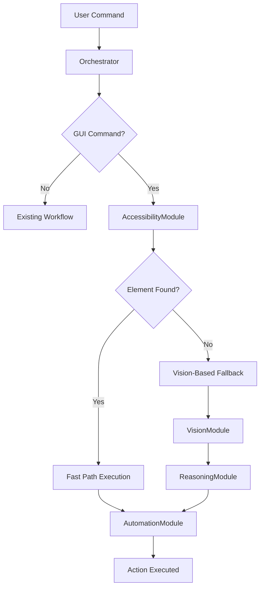

# Design Document

## Overview

The hybrid architecture implementation introduces a dual-path system for GUI automation in AURA. The system prioritizes a "Fast Path" using macOS Accessibility APIs for near-instantaneous element detection and action execution, while maintaining the existing "Slow Path" vision-based workflow as a reliable fallback for complex or non-standard applications.

This design leverages the existing robust architecture of AURA while adding a new high-performance layer that can dramatically reduce latency for common GUI operations.

## Architecture

### High-Level System Flow



### Component Integration

The hybrid architecture integrates seamlessly with the existing AURA system:

- **Orchestrator**: Enhanced to route GUI commands through the fast path first
- **AccessibilityModule**: New component providing macOS Accessibility API interface
- **AutomationModule**: Existing component, enhanced to handle fast path coordinates
- **VisionModule**: Existing component, used as fallback when fast path fails
- **ReasoningModule**: Existing component, bypassed in fast path scenarios

## Components and Interfaces

### AccessibilityModule

**Location**: `modules/accessibility.py`

**Purpose**: Provides high-speed, non-visual interface for querying macOS UI elements using the Accessibility API.

**Key Dependencies**:

- `pyobjc-framework-AppKit`
- `pyobjc-framework-Accessibility`

**Core Interface**:

```python
class AccessibilityModule:
    def __init__(self):
        """Initialize accessibility API connections."""

    def find_element(self, role: str, label: str, app_name: Optional[str] = None) -> Optional[Dict[str, Any]]:
        """
        Find UI element by role and label.

        Args:
            role: Accessibility role (e.g., 'AXButton', 'AXMenuItem')
            label: Element label or title
            app_name: Optional application name to limit search scope

        Returns:
            Dictionary with element details or None if not found:
            {
                'coordinates': [x, y, width, height],
                'center_point': [center_x, center_y],
                'role': 'AXButton',
                'title': 'Sign In',
                'enabled': True,
                'app_name': 'Safari'
            }
        """

    def get_active_application(self) -> Optional[Dict[str, Any]]:
        """Get information about the currently active application."""

    def traverse_accessibility_tree(self, element, max_depth: int = 5) -> List[Dict[str, Any]]:
        """Recursively traverse accessibility tree to find all elements."""
```

### Enhanced Orchestrator

**Modifications to existing `orchestrator.py`**:

1. **New Initialization**:

   - Import and initialize `AccessibilityModule`
   - Add fast path configuration options

2. **Enhanced Command Execution**:

   - Route GUI commands through fast path first
   - Implement fallback logic to existing vision workflow
   - Add performance tracking for both paths

3. **New Methods**:

```python
def _attempt_fast_path_execution(self, command: str, command_info: Dict) -> Optional[Dict[str, Any]]:
    """
    Attempt to execute command using fast path accessibility detection.

    Returns:
        Action result if successful, None if fast path fails
    """

def _extract_gui_elements_from_command(self, command: str) -> Dict[str, str]:
    """
    Extract target element information from user command.

    Returns:
        Dictionary with 'role', 'label', and 'action' keys
    """
```

### Enhanced AutomationModule

**Modifications to existing `modules/automation.py`**:

1. **Fast Path Action Execution**:

   - Accept pre-calculated coordinates from AccessibilityModule
   - Bypass coordinate validation for trusted accessibility coordinates
   - Add fast path performance metrics

2. **New Methods**:

```python
def execute_fast_path_action(self, action_type: str, coordinates: List[int], **kwargs) -> Dict[str, Any]:
    """
    Execute action with pre-validated coordinates from accessibility API.

    Args:
        action_type: 'click', 'double_click', 'type', etc.
        coordinates: [x, y] or [x, y, width, height] from accessibility API
        **kwargs: Additional action parameters
    """
```

## Data Models

### AccessibilityElement

```python
@dataclass
class AccessibilityElement:
    """Represents a UI element found via Accessibility API."""
    role: str                    # AXButton, AXMenuItem, etc.
    title: str                   # Element title/label
    coordinates: List[int]       # [x, y, width, height]
    center_point: List[int]      # [center_x, center_y]
    enabled: bool               # Whether element is enabled
    app_name: str               # Parent application name
    element_id: Optional[str]   # Unique identifier if available
    attributes: Dict[str, Any]  # Additional accessibility attributes
```

### FastPathResult

```python
@dataclass
class FastPathResult:
    """Result of fast path execution attempt."""
    success: bool
    element_found: Optional[AccessibilityElement]
    action_executed: bool
    execution_time: float
    error_message: Optional[str]
    fallback_required: bool
```

### HybridPerformanceMetrics

```python
@dataclass
class HybridPerformanceMetrics:
    """Performance metrics for hybrid execution."""
    command: str
    path_used: str              # 'fast' or 'slow'
    total_execution_time: float
    element_detection_time: float
    action_execution_time: float
    success: bool
    fallback_triggered: bool
    app_name: Optional[str]
```

## Error Handling

### Fast Path Error Categories

1. **Accessibility API Errors**:

   - API unavailable or disabled
   - Permission denied
   - Application not accessible

2. **Element Detection Errors**:

   - Element not found
   - Multiple elements match criteria
   - Element not actionable

3. **Execution Errors**:
   - Coordinate calculation failure
   - Action execution failure
   - Timing issues

### Error Recovery Strategy

```python
def handle_fast_path_error(self, error: Exception, command: str) -> bool:
    """
    Handle fast path errors with appropriate recovery.

    Returns:
        True if fallback should be attempted, False if command should fail
    """
    if isinstance(error, AccessibilityPermissionError):
        # Log permission issue, attempt fallback
        return True
    elif isinstance(error, ElementNotFoundError):
        # Element not accessible, try vision fallback
        return True
    elif isinstance(error, AccessibilityAPIUnavailableError):
        # Disable fast path for session, use fallback
        self.fast_path_enabled = False
        return True
    else:
        # Unknown error, attempt fallback
        return True
```

### Graceful Degradation

- **Fast Path Disabled**: System continues with vision-only workflow
- **Partial Accessibility**: Some elements accessible, others fall back to vision
- **Performance Monitoring**: Track success rates and automatically adjust strategy

## Testing Strategy

### Unit Testing

1. **AccessibilityModule Tests** (`tests/test_accessibility.py`):

   - Mock accessibility API responses
   - Test element detection accuracy
   - Validate coordinate calculations
   - Error handling scenarios

2. **Orchestrator Integration Tests** (`tests/test_hybrid_orchestration.py`):
   - Fast path routing logic
   - Fallback mechanism validation
   - Performance metric collection
   - Command parsing accuracy

### Integration Testing

1. **End-to-End Fast Path Tests**:

   - Native macOS applications (Finder, System Preferences)
   - Web browsers (Safari, Chrome)
   - Common GUI patterns (menus, buttons, forms)

2. **Fallback Validation Tests**:

   - Non-accessible applications
   - Complex UI elements (canvas, custom controls)
   - Error injection scenarios

3. **Performance Benchmarking**:
   - Fast path vs. slow path timing comparison
   - Success rate measurement across application types
   - Resource usage analysis

### Manual Testing Scenarios

1. **Native Application Testing**:

   - Finder navigation and file operations
   - System Preferences modifications
   - Menu bar interactions

2. **Web Application Testing**:

   - Form filling in standard web pages
   - Navigation in web applications
   - Complex JavaScript-heavy sites

3. **Edge Case Testing**:
   - Applications with accessibility disabled
   - Custom UI frameworks
   - Multi-monitor setups

## Performance Optimizations

### Caching Strategy

1. **Application Element Cache**:

   - Cache accessibility tree for active applications
   - Invalidate on application focus change
   - TTL-based cache expiration

2. **Element Lookup Optimization**:
   - Index elements by role and title
   - Fuzzy matching for similar element names
   - Hierarchical search optimization

### Parallel Processing

1. **Concurrent Detection**:

   - Run accessibility detection in parallel with vision capture
   - Use fastest available result
   - Cancel slower operation when fast path succeeds

2. **Background Preparation**:
   - Pre-load accessibility tree for active application
   - Maintain element index in background
   - Predictive element caching

### Resource Management

1. **Memory Usage**:

   - Limit accessibility tree cache size
   - Efficient element representation
   - Garbage collection of stale references

2. **CPU Optimization**:
   - Lazy loading of accessibility elements
   - Efficient tree traversal algorithms
   - Minimal coordinate calculations

## Security Considerations

### Privacy Protection

1. **Data Minimization**:

   - Only capture necessary element attributes
   - Avoid logging sensitive element content
   - Clear caches containing sensitive data

2. **Permission Management**:
   - Request minimal accessibility permissions
   - Graceful handling of permission denial
   - User notification of permission requirements

### System Safety

1. **Failsafe Mechanisms**:

   - Coordinate validation before action execution
   - Rate limiting for rapid-fire commands
   - Emergency stop functionality

2. **Application Isolation**:
   - Limit accessibility scope to target applications
   - Prevent cross-application interference
   - Validate application identity before actions
