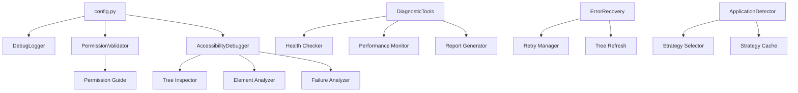

# AURA Debugging Developer Guide

This guide is for developers who want to extend AURA's debugging capabilities, add new diagnostic tools, or integrate debugging features into their own modules.

## Table of Contents

1. [Architecture Overview](#architecture-overview)
2. [Core Debugging Components](#core-debugging-components)
3. [Adding New Debugging Features](#adding-new-debugging-features)
4. [Creating Custom Diagnostic Tools](#creating-custom-diagnostic-tools)
5. [Extending Error Recovery](#extending-error-recovery)
6. [Performance Monitoring Integration](#performance-monitoring-integration)
7. [Testing Debugging Features](#testing-debugging-features)
8. [Best Practices](#best-practices)

## Architecture Overview

### Debugging System Components



### Key Interfaces

#### IDebugger Interface

```python
from abc import ABC, abstractmethod
from typing import Dict, Any, List, Optional

class IDebugger(ABC):
    """Base interface for debugging components."""

    @abstractmethod
    def initialize(self, config: Dict[str, Any]) -> None:
        """Initialize the debugger with configuration."""
        pass

    @abstractmethod
    def debug_operation(self, operation: str, context: Dict[str, Any]) -> Dict[str, Any]:
        """Debug a specific operation."""
        pass

    @abstractmethod
    def generate_report(self) -> Dict[str, Any]:
        """Generate a debugging report."""
        pass
```

#### IDiagnosticTool Interface

```python
class IDiagnosticTool(ABC):
    """Base interface for diagnostic tools."""

    @abstractmethod
    def run_diagnostic(self) -> 'DiagnosticResult':
        """Run the diagnostic and return results."""
        pass

    @abstractmethod
    def get_recommendations(self, result: 'DiagnosticResult') -> List[str]:
        """Get recommendations based on diagnostic results."""
        pass
```

## Core Debugging Components

### AccessibilityDebugger

The main debugging component for accessibility issues.

```python
# modules/accessibility_debugger.py
from typing import Dict, Any, List, Optional
import logging
from dataclasses import dataclass
from datetime import datetime

@dataclass
class AccessibilityTreeDump:
    """Complete accessibility tree structure."""
    app_name: str
    timestamp: datetime
    root_element: Dict[str, Any]
    total_elements: int
    clickable_elements: List[Dict[str, Any]]
    searchable_elements: List[Dict[str, Any]]
    element_roles: Dict[str, int]
    attribute_coverage: Dict[str, int]

class AccessibilityDebugger:
    """Comprehensive debugging for accessibility issues."""

    def __init__(self, config: Dict[str, Any]):
        self.config = config
        self.logger = logging.getLogger(__name__)
        self.debug_level = config.get('debug_level', 'BASIC')
        self.tree_cache = {} if config.get('tree_dump_cache_enabled', True) else None

    def dump_accessibility_tree(self, app_name: Optional[str] = None) -> AccessibilityTreeDump:
        """Generate complete accessibility tree dump."""
        if self.tree_cache and app_name in self.tree_cache:
            cached_dump = self.tree_cache[app_name]
            if self._is_cache_valid(cached_dump):
                return cached_dump

        # Implementation for tree dumping
        tree_dump = self._perform_tree_dump(app_name)

        if self.tree_cache:
            self.tree_cache[app_name] = tree_dump

        return tree_dump

    def analyze_element_detection_failure(self, command: str, target: str) -> 'FailureAnalysis':
        """Analyze why element detection failed."""
        # Implementation for failure analysis
        pass

    def _perform_tree_dump(self, app_name: Optional[str]) -> AccessibilityTreeDump:
        """Perform the actual tree dump operation."""
        # Implementation details
        pass
```

### PermissionValidator

Handles accessibility permission validation and guidance.

```python
# modules/permission_validator.py
from dataclasses import dataclass
from typing import List, Dict, Any
import subprocess
import os

@dataclass
class PermissionStatus:
    """Detailed accessibility permission status."""
    has_permissions: bool
    permission_level: str  # 'NONE', 'PARTIAL', 'FULL'
    missing_permissions: List[str]
    granted_permissions: List[str]
    can_request_permissions: bool
    system_version: str
    recommendations: List[str]

class PermissionValidator:
    """Validates and guides accessibility permission setup."""

    def check_accessibility_permissions(self) -> PermissionStatus:
        """Check current accessibility permission status."""
        try:
            # Check using PyObjC
            from Cocoa import NSWorkspace
            from ApplicationServices import AXIsProcessTrusted, AXIsProcessTrustedWithOptions

            is_trusted = AXIsProcessTrusted()

            return PermissionStatus(
                has_permissions=is_trusted,
                permission_level='FULL' if is_trusted else 'NONE',
                missing_permissions=[] if is_trusted else ['accessibility'],
                granted_permissions=['accessibility'] if is_trusted else [],
                can_request_permissions=True,
                system_version=self._get_system_version(),
                recommendations=[] if is_trusted else self._get_permission_recommendations()
            )
        except Exception as e:
            return PermissionStatus(
                has_permissions=False,
                permission_level='UNKNOWN',
                missing_permissions=['accessibility'],
                granted_permissions=[],
                can_request_permissions=False,
                system_version=self._get_system_version(),
                recommendations=[f"Error checking permissions: {e}"]
            )

    def guide_permission_setup(self) -> List[str]:
        """Provide step-by-step permission setup instructions."""
        return [
            "Open System Preferences",
            "Go to Security & Privacy",
            "Click on the Privacy tab",
            "Select Accessibility from the left sidebar",
            "Click the lock icon and enter your password",
            "Find your terminal application or Python interpreter",
            "Check the box to enable accessibility access",
            "Restart AURA"
        ]
```

### DiagnosticTools

Comprehensive system diagnostics and health checking.

```python
# modules/diagnostic_tools.py
from typing import Dict, Any, List
from dataclasses import dataclass
from datetime import datetime
import json

@dataclass
class DiagnosticResult:
    """Result of a diagnostic operation."""
    name: str
    status: str  # 'PASS', 'FAIL', 'WARNING'
    message: str
    details: Dict[str, Any]
    recommendations: List[str]
    timestamp: datetime

@dataclass
class DiagnosticReport:
    """Comprehensive diagnostic report."""
    timestamp: datetime
    overall_status: str
    results: List[DiagnosticResult]
    success_rate: float
    average_response_time: float
    detected_issues: List[Dict[str, Any]]
    recommendations: List[str]

class DiagnosticTools:
    """Automated diagnostic tools for system health checking."""

    def __init__(self, config: Dict[str, Any] = None):
        self.config = config or {}
        self.diagnostics = [
            self._check_permissions,
            self._check_accessibility_api,
            self._check_application_detection,
            self._check_element_detection,
            self._check_performance_metrics
        ]

    def run_comprehensive_diagnostics(self) -> DiagnosticReport:
        """Run all diagnostic checks."""
        results = []

        for diagnostic in self.diagnostics:
            try:
                result = diagnostic()
                results.append(result)
            except Exception as e:
                results.append(DiagnosticResult(
                    name=diagnostic.__name__,
                    status='FAIL',
                    message=f"Diagnostic failed: {e}",
                    details={'error': str(e)},
                    recommendations=[f"Fix error in {diagnostic.__name__}"],
                    timestamp=datetime.now()
                ))

        return self._generate_report(results)

    def _check_permissions(self) -> DiagnosticResult:
        """Check accessibility permissions."""
        from .permission_validator import PermissionValidator

        validator = PermissionValidator()
        status = validator.check_accessibility_permissions()

        return DiagnosticResult(
            name="Permission Check",
            status='PASS' if status.has_permissions else 'FAIL',
            message=f"Accessibility permissions: {status.permission_level}",
            details=status.__dict__,
            recommendations=status.recommendations,
            timestamp=datetime.now()
        )

    def _generate_report(self, results: List[DiagnosticResult]) -> DiagnosticReport:
        """Generate comprehensive diagnostic report."""
        pass_count = sum(1 for r in results if r.status == 'PASS')
        success_rate = pass_count / len(results) if results else 0

        overall_status = 'HEALTHY' if success_rate > 0.8 else 'NEEDS_ATTENTION'

        return DiagnosticReport(
            timestamp=datetime.now(),
            overall_status=overall_status,
            results=results,
            success_rate=success_rate,
            average_response_time=0.0,  # Calculate from performance metrics
            detected_issues=[],  # Extract from failed results
            recommendations=[]   # Aggregate from all results
        )
```

## Adding New Debugging Features

### Step 1: Define the Feature Interface

```python
# modules/my_custom_debugger.py
from .accessibility_debugger import IDebugger
from typing import Dict, Any

class MyCustomDebugger(IDebugger):
    """Custom debugging feature for specific use case."""

    def initialize(self, config: Dict[str, Any]) -> None:
        """Initialize with configuration."""
        self.config = config
        self.enabled = config.get('my_feature_enabled', True)

    def debug_operation(self, operation: str, context: Dict[str, Any]) -> Dict[str, Any]:
        """Debug a specific operation."""
        if not self.enabled:
            return {}

        # Your debugging logic here
        debug_info = {
            'operation': operation,
            'context': context,
            'timestamp': datetime.now().isoformat(),
            'custom_data': self._collect_custom_data(context)
        }

        return debug_info

    def generate_report(self) -> Dict[str, Any]:
        """Generate debugging report."""
        return {
            'feature_name': 'MyCustomDebugger',
            'status': 'active' if self.enabled else 'disabled',
            'metrics': self._collect_metrics()
        }

    def _collect_custom_data(self, context: Dict[str, Any]) -> Dict[str, Any]:
        """Collect feature-specific debugging data."""
        # Implementation specific to your feature
        pass
```

### Step 2: Add Configuration Options

```python
# In config.py, add your feature configuration
# -- My Custom Debugging Feature --
MY_CUSTOM_DEBUGGER_ENABLED = True
MY_CUSTOM_DEBUGGER_TIMEOUT = 5.0
MY_CUSTOM_DEBUGGER_CACHE_SIZE = 100
MY_CUSTOM_DEBUGGER_LOG_LEVEL = "INFO"
```

### Step 3: Integrate with Main Debugging System

```python
# In modules/accessibility_debugger.py
from .my_custom_debugger import MyCustomDebugger

class AccessibilityDebugger:
    def __init__(self, config: Dict[str, Any]):
        # ... existing initialization ...

        # Add your custom debugger
        if config.get('MY_CUSTOM_DEBUGGER_ENABLED', False):
            self.custom_debugger = MyCustomDebugger()
            self.custom_debugger.initialize(config)
        else:
            self.custom_debugger = None

    def debug_operation(self, operation: str, context: Dict[str, Any]) -> Dict[str, Any]:
        """Enhanced debug operation with custom features."""
        debug_info = {}

        # ... existing debugging logic ...

        # Add custom debugging
        if self.custom_debugger:
            custom_info = self.custom_debugger.debug_operation(operation, context)
            debug_info['custom'] = custom_info

        return debug_info
```

### Step 4: Add Tests

```python
# tests/test_my_custom_debugger.py
import pytest
from modules.my_custom_debugger import MyCustomDebugger

class TestMyCustomDebugger:
    def test_initialization(self):
        """Test debugger initialization."""
        config = {'my_feature_enabled': True}
        debugger = MyCustomDebugger()
        debugger.initialize(config)

        assert debugger.enabled == True
        assert debugger.config == config

    def test_debug_operation(self):
        """Test debug operation functionality."""
        debugger = MyCustomDebugger()
        debugger.initialize({'my_feature_enabled': True})

        result = debugger.debug_operation('test_op', {'key': 'value'})

        assert 'operation' in result
        assert 'context' in result
        assert 'timestamp' in result
        assert result['operation'] == 'test_op'

    def test_disabled_debugger(self):
        """Test debugger when disabled."""
        debugger = MyCustomDebugger()
        debugger.initialize({'my_feature_enabled': False})

        result = debugger.debug_operation('test_op', {})

        assert result == {}
```

## Creating Custom Diagnostic Tools

### Step 1: Implement IDiagnosticTool

```python
# modules/my_diagnostic_tool.py
from .diagnostic_tools import IDiagnosticTool, DiagnosticResult
from datetime import datetime
from typing import List

class MyDiagnosticTool(IDiagnosticTool):
    """Custom diagnostic tool for specific checks."""

    def __init__(self, config: Dict[str, Any] = None):
        self.config = config or {}
        self.name = "My Custom Diagnostic"

    def run_diagnostic(self) -> DiagnosticResult:
        """Run the diagnostic check."""
        try:
            # Your diagnostic logic here
            check_result = self._perform_check()

            if check_result['success']:
                return DiagnosticResult(
                    name=self.name,
                    status='PASS',
                    message=check_result['message'],
                    details=check_result['details'],
                    recommendations=[],
                    timestamp=datetime.now()
                )
            else:
                return DiagnosticResult(
                    name=self.name,
                    status='FAIL',
                    message=check_result['message'],
                    details=check_result['details'],
                    recommendations=self.get_recommendations(None),
                    timestamp=datetime.now()
                )

        except Exception as e:
            return DiagnosticResult(
                name=self.name,
                status='FAIL',
                message=f"Diagnostic failed: {e}",
                details={'error': str(e)},
                recommendations=[f"Fix error in {self.name}"],
                timestamp=datetime.now()
            )

    def get_recommendations(self, result: DiagnosticResult) -> List[str]:
        """Get recommendations for fixing issues."""
        return [
            "Check configuration settings",
            "Verify system requirements",
            "Restart the application"
        ]

    def _perform_check(self) -> Dict[str, Any]:
        """Perform the actual diagnostic check."""
        # Implement your specific check logic
        # Return dict with 'success', 'message', 'details'
        pass
```

### Step 2: Register with DiagnosticTools

```python
# In modules/diagnostic_tools.py
from .my_diagnostic_tool import MyDiagnosticTool

class DiagnosticTools:
    def __init__(self, config: Dict[str, Any] = None):
        # ... existing initialization ...

        # Add custom diagnostic tools
        self.custom_diagnostics = []
        if config and config.get('MY_DIAGNOSTIC_TOOL_ENABLED', False):
            self.custom_diagnostics.append(MyDiagnosticTool(config))

    def run_comprehensive_diagnostics(self) -> DiagnosticReport:
        """Run all diagnostic checks including custom ones."""
        results = []

        # Run standard diagnostics
        for diagnostic in self.diagnostics:
            # ... existing logic ...

        # Run custom diagnostics
        for diagnostic_tool in self.custom_diagnostics:
            try:
                result = diagnostic_tool.run_diagnostic()
                results.append(result)
            except Exception as e:
                # Handle errors
                pass

        return self._generate_report(results)
```

## Extending Error Recovery

### Custom Recovery Strategy

```python
# modules/my_error_recovery.py
from .error_recovery import IErrorRecovery, RecoveryResult
from typing import Dict, Any, Callable

class MyErrorRecovery(IErrorRecovery):
    """Custom error recovery strategy."""

    def __init__(self, config: Dict[str, Any]):
        self.config = config
        self.max_retries = config.get('my_recovery_max_retries', 3)
        self.recovery_strategies = [
            self._strategy_refresh_cache,
            self._strategy_alternative_method,
            self._strategy_fallback_approach
        ]

    def attempt_recovery(self, error: Exception, context: Dict[str, Any]) -> RecoveryResult:
        """Attempt to recover from the error."""
        for i, strategy in enumerate(self.recovery_strategies):
            try:
                result = strategy(error, context)
                if result.success:
                    return result
            except Exception as recovery_error:
                # Log recovery attempt failure
                pass

        return RecoveryResult(
            success=False,
            message="All recovery strategies failed",
            actions_taken=[],
            retry_recommended=False
        )

    def _strategy_refresh_cache(self, error: Exception, context: Dict[str, Any]) -> RecoveryResult:
        """Recovery strategy: refresh cache."""
        # Implementation for cache refresh
        pass

    def _strategy_alternative_method(self, error: Exception, context: Dict[str, Any]) -> RecoveryResult:
        """Recovery strategy: try alternative method."""
        # Implementation for alternative approach
        pass
```

## Performance Monitoring Integration

### Custom Performance Monitor

```python
# modules/my_performance_monitor.py
from typing import Dict, Any, List
from dataclasses import dataclass
from datetime import datetime, timedelta
import time

@dataclass
class PerformanceMetric:
    """Individual performance metric."""
    name: str
    value: float
    unit: str
    timestamp: datetime
    context: Dict[str, Any]

class MyPerformanceMonitor:
    """Custom performance monitoring for specific operations."""

    def __init__(self, config: Dict[str, Any]):
        self.config = config
        self.metrics = []
        self.enabled = config.get('my_performance_monitoring_enabled', True)
        self.max_history = config.get('my_performance_history_size', 1000)

    def start_timing(self, operation_name: str, context: Dict[str, Any] = None) -> str:
        """Start timing an operation."""
        if not self.enabled:
            return ""

        timing_id = f"{operation_name}_{int(time.time() * 1000)}"
        self._timings[timing_id] = {
            'start_time': time.time(),
            'operation': operation_name,
            'context': context or {}
        }
        return timing_id

    def end_timing(self, timing_id: str) -> PerformanceMetric:
        """End timing and record metric."""
        if not self.enabled or timing_id not in self._timings:
            return None

        timing_info = self._timings.pop(timing_id)
        duration = time.time() - timing_info['start_time']

        metric = PerformanceMetric(
            name=timing_info['operation'],
            value=duration,
            unit='seconds',
            timestamp=datetime.now(),
            context=timing_info['context']
        )

        self._record_metric(metric)
        return metric

    def get_performance_summary(self, time_window: timedelta = None) -> Dict[str, Any]:
        """Get performance summary for specified time window."""
        if time_window is None:
            time_window = timedelta(hours=1)

        cutoff_time = datetime.now() - time_window
        recent_metrics = [m for m in self.metrics if m.timestamp >= cutoff_time]

        if not recent_metrics:
            return {'message': 'No metrics in time window'}

        # Calculate statistics
        durations = [m.value for m in recent_metrics]
        return {
            'count': len(recent_metrics),
            'average': sum(durations) / len(durations),
            'min': min(durations),
            'max': max(durations),
            'time_window': str(time_window)
        }
```

## Testing Debugging Features

### Unit Testing Framework

```python
# tests/test_debugging_framework.py
import pytest
from unittest.mock import Mock, patch, MagicMock
from modules.accessibility_debugger import AccessibilityDebugger
from modules.diagnostic_tools import DiagnosticTools

class TestDebuggingFramework:
    """Test framework for debugging features."""

    @pytest.fixture
    def mock_config(self):
        """Mock configuration for testing."""
        return {
            'debug_level': 'DETAILED',
            'tree_inspection_enabled': True,
            'element_analysis_enabled': True,
            'diagnostic_tools_enabled': True
        }

    @pytest.fixture
    def debugger(self, mock_config):
        """Create debugger instance for testing."""
        return AccessibilityDebugger(mock_config)

    def test_debugger_initialization(self, debugger, mock_config):
        """Test debugger initializes correctly."""
        assert debugger.config == mock_config
        assert debugger.debug_level == 'DETAILED'

    @patch('modules.accessibility_debugger.AXUIElementCreateApplication')
    def test_tree_dump_with_mock(self, mock_ax_create, debugger):
        """Test tree dump with mocked accessibility API."""
        # Setup mock
        mock_app = MagicMock()
        mock_ax_create.return_value = mock_app

        # Test tree dump
        result = debugger.dump_accessibility_tree('TestApp')

        assert result is not None
        assert result.app_name == 'TestApp'
        mock_ax_create.assert_called_once()

    def test_diagnostic_tools_integration(self, mock_config):
        """Test diagnostic tools integration."""
        diagnostics = DiagnosticTools(mock_config)
        report = diagnostics.run_comprehensive_diagnostics()

        assert report is not None
        assert hasattr(report, 'overall_status')
        assert hasattr(report, 'results')
```

### Integration Testing

```python
# tests/test_debugging_integration.py
import pytest
from modules.accessibility_debugger import AccessibilityDebugger
from modules.permission_validator import PermissionValidator
from modules.diagnostic_tools import DiagnosticTools

class TestDebuggingIntegration:
    """Integration tests for debugging system."""

    def test_full_debugging_workflow(self):
        """Test complete debugging workflow."""
        # 1. Check permissions
        validator = PermissionValidator()
        permission_status = validator.check_accessibility_permissions()

        # 2. Initialize debugger
        config = {'debug_level': 'DETAILED'}
        debugger = AccessibilityDebugger(config)

        # 3. Run diagnostics
        diagnostics = DiagnosticTools(config)
        report = diagnostics.run_comprehensive_diagnostics()

        # 4. Verify workflow completed
        assert permission_status is not None
        assert debugger is not None
        assert report is not None

    @pytest.mark.skipif(not has_accessibility_permissions(),
                       reason="Requires accessibility permissions")
    def test_real_accessibility_tree_dump(self):
        """Test with real accessibility API (requires permissions)."""
        debugger = AccessibilityDebugger({'debug_level': 'VERBOSE'})
        tree = debugger.dump_accessibility_tree('Finder')

        assert tree.total_elements > 0
        assert len(tree.clickable_elements) > 0
```

## Best Practices

### 1. Configuration Management

```python
# Always validate configuration
def validate_custom_config(config: Dict[str, Any]) -> tuple[bool, List[str]]:
    """Validate custom debugging configuration."""
    errors = []

    # Check required fields
    if 'my_feature_enabled' not in config:
        errors.append("Missing 'my_feature_enabled' configuration")

    # Validate types
    if not isinstance(config.get('my_timeout', 0), (int, float)):
        errors.append("'my_timeout' must be a number")

    # Validate ranges
    timeout = config.get('my_timeout', 0)
    if timeout <= 0 or timeout > 60:
        errors.append("'my_timeout' must be between 0 and 60 seconds")

    return len(errors) == 0, errors
```

### 2. Error Handling

```python
# Always handle errors gracefully in debugging code
def safe_debug_operation(operation_func, fallback_value=None):
    """Safely execute debugging operation with fallback."""
    try:
        return operation_func()
    except Exception as e:
        logger.warning(f"Debug operation failed: {e}")
        return fallback_value
```

### 3. Performance Considerations

```python
# Use lazy evaluation for expensive operations
class LazyDebugger:
    def __init__(self, config):
        self.config = config
        self._tree_dump = None

    @property
    def tree_dump(self):
        """Lazy-loaded tree dump."""
        if self._tree_dump is None:
            self._tree_dump = self._generate_tree_dump()
        return self._tree_dump

    def _generate_tree_dump(self):
        """Generate tree dump only when needed."""
        # Expensive operation here
        pass
```

### 4. Logging Best Practices

```python
import logging
from typing import Dict, Any

class DebugLogger:
    """Structured logging for debugging features."""

    def __init__(self, name: str, config: Dict[str, Any]):
        self.logger = logging.getLogger(name)
        self.debug_level = config.get('debug_level', 'BASIC')
        self.structured_logging = config.get('structured_logging', True)

    def debug_info(self, message: str, context: Dict[str, Any] = None):
        """Log debug information with context."""
        if self.structured_logging:
            log_data = {
                'message': message,
                'context': context or {},
                'debug_level': self.debug_level
            }
            self.logger.info(f"DEBUG: {json.dumps(log_data)}")
        else:
            self.logger.info(f"DEBUG: {message}")
```

### 5. Testing Guidelines

```python
# Use dependency injection for testability
class TestableDebugger:
    def __init__(self, config, accessibility_api=None):
        self.config = config
        self.accessibility_api = accessibility_api or self._create_accessibility_api()

    def _create_accessibility_api(self):
        """Create real accessibility API."""
        # Real implementation
        pass

    def debug_operation(self, operation):
        """Debug operation using injected API."""
        return self.accessibility_api.perform_operation(operation)

# In tests, inject mock API
def test_debugger_with_mock():
    mock_api = Mock()
    debugger = TestableDebugger({}, accessibility_api=mock_api)

    result = debugger.debug_operation('test')
    mock_api.perform_operation.assert_called_once_with('test')
```

This developer guide provides the foundation for extending AURA's debugging capabilities. Follow these patterns and best practices to create robust, testable debugging features that integrate seamlessly with the existing system.
